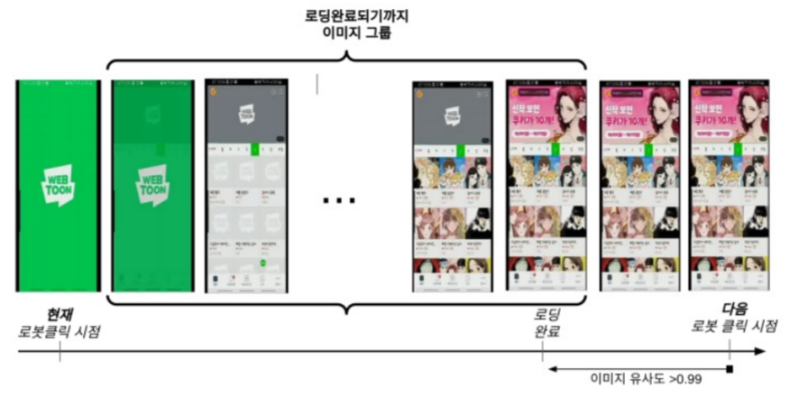

# Performance Analyzer

### 1. 스피드 인덱스

####     1.1 스피드 인덱스 설

* webpagetest.org 와 google의 testmypage에서 사용하는 성능 지표 단
* 페이지가 시각적으로 얼마나 빠르게 그려지는지에대한 전체 점수를 계산
* 같은 로딩시간이라도 얼마나 빠르게 이미지들이 화면을 채우는가에따라 실행결과가 달라질 수 있음

####    1.2 스피드 인덱스 구

1. 카메라에 스트리밍 했던 동영상을 읽어 ffmpeg를 통해 동영상avi를 0.1초 단위로 나누어 png로 저장
2. 저장되어있는 로봇의 클릭 시점의 파일을 읽어 png와 맞춤
3. 이미지 유사도를 통해 로딩 시작부터 로딩이 완료된 직후까지의 이미지 들을 모아 스피드 인덱스를 계산할 이미지 그룹으로 만듦
4. 만들어진 이미지 그룹은 로딩이 완료된 이미지와 유사도비교를 하여 몇 %와 차이가 있는지 총합을 통해 계

####    1.3 이용한 이미지 유사도 알고리즘비

| 이미지 유사 | 설 |
| :--- | :--- |
| SSIM |  |
| Correlated2d |  |
|  |  |
|  |  |

### 2. 스피드 인덱스 분석기 서빙 모듈

####    2.1 멀티 프로세스와 큐를 이용한 서빙 모

|  |  |
| :--- | :--- |
|  |  |

1. 성능 분석기와 다른 모듈간의 연산 시간차이 발생으로 인한 지연시간을 줄이기위해 멀티프로세스사
   1. 성능분석기 연산시간 10분, 다른 모듈들의 연산시간3분 성능분석기때문에 다른 모듈 연산을 기다려야하는 상황 발생
   2. 빠른 실행을 위하여 성능분석기 연산시간을 기다리지 않고 다른 프로세스들이 실행되도록구현 
2. 로봇 매니저로부터 요청받은 결과를 큐에 넣고, 스레드는 큐가 빌때까지 순차적으로 동작하도록 구현
3. 실행이 완료되면 결과를 데이터베이스에 저장 

